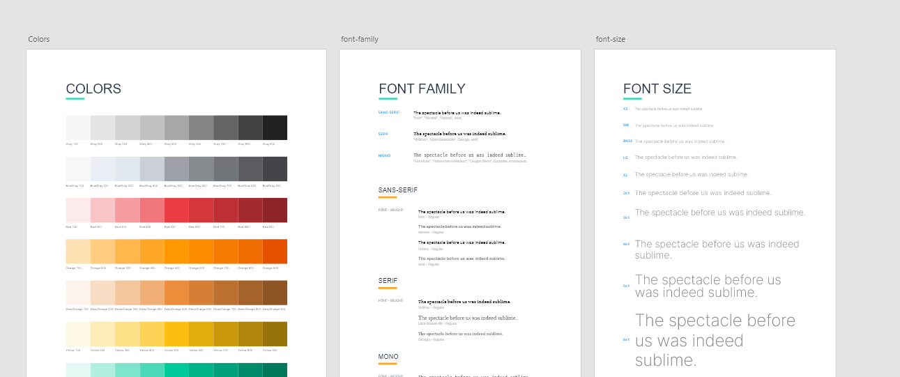

# Tecnologia design tokens
<!-- ALL-CONTRIBUTORS-BADGE:START - Do not remove or modify this section -->

<!-- ALL-CONTRIBUTORS-BADGE:END -->

Design tokens created for BPM Suite products. 
A library using `style-dictionary`.

## Contributors ✨

Thanks goes to these wonderful people ([emoji key](https://allcontributors.org/docs/en/emoji-key)):

<!-- ALL-CONTRIBUTORS-LIST:START - Do not remove or modify this section -->
<!-- prettier-ignore-start -->
<!-- markdownlint-disable -->
<table>
  <tr>
    <td align="center"><a href="http://linkedin.com/in/tiagoboeing/"> <b>Tiago Boeing</b></a> <a href="#infra-tiagoboeing" title="Infrastructure (Hosting, Build-Tools, etc)">🚇</a> <a href="https://github.com/SeniorSA/tecnologia-design-tokens/commits?author=tiagoboeing" title="Code">💻</a> <a href="#design-tiagoboeing" title="Design">🎨</a> <a href="#projectManagement-tiagoboeing" title="Project Management">📆</a> <a href="https://github.com/SeniorSA/tecnologia-design-tokens/commits?author=tiagoboeing" title="Documentation">📖</a></td>
  </tr>
</table>

<!-- markdownlint-restore -->
<!-- prettier-ignore-end -->

<!-- ALL-CONTRIBUTORS-LIST:END -->

This project follows the [all-contributors](https://github.com/all-contributors/all-contributors) specification. Contributions of any kind welcome!